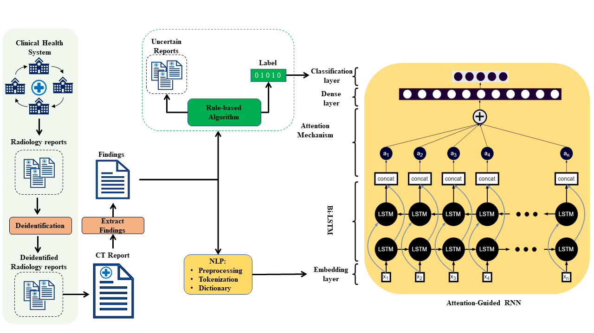

# Multi-Label Annotation of Text Reports from Computed Tomography of the Chest Abdomen and Pelvis Using RBA and Deep Learning

This Repo contains the updated implementation of our paper "**Multi-Label Annotation of Text Reports from Computed Tomography of the Chest Abdomen and Pelvis Using Deep Learning**" (Will be Submitted to JMI) a pre-print is available: **"Multi-Label Annotation of Chest Abdomen Pelvis Computed Tomography Text Reports Using Deep Learning"** : https://arxiv.org/abs/2102.02959

### Citation
```ruby
@misc{danniballe2021multilabel,
      title={Multi-Label Annotation of Chest Abdomen Pelvis Computed Tomography Text Reports Using Deep Learning}, 
      author={Vincent M. D'Anniballe and Fakrul I. Tushar and Khrystyna Faryna and Songyue Han and Maciej A. Mazurowski and Geoffrey D. Rubin and Joseph Y. Lo},
      year={2021},
      eprint={2102.02959},
      archivePrefix={arXiv},
      primaryClass={cs.AI}
}
```
```ruby
D'Anniballe, V.M., Tushar, F.I., Faryna, K., Han, S., Mazurowski, M.A., Rubin, G.D., Lo, J.Y., 2021. 
Multi-Label Annotation of Chest Abdomen Pelvis Computed Tomography Text Reports Using Deep Learning, p. arXiv:2102.02959.
```
### Abstract
To develop a high throughput multi-label annotator for body Computed Tomography (CT) reports that can be applied to a variety of diseases, organs, and cases. First, we used a dictionary approach to develop a rule-based algorithm (RBA) for extraction of disease labels from radiology text reports. We targeted three organ systems (lungs/pleura, liver/gallbladder, kidneys/ureters) with four diseases per system based on their prevalence in our dataset. To expand the algorithm beyond pre-defined keywords, an attention-guided recurrent neural network (RNN) was trained using the RBA-extracted labels to classify the reports as being positive for one or more diseases or normal for each organ system. Confounding effects on model performance were evaluated using random or pre-trained embedding as well as different sizes of training datasets. Performance was evaluated using the receiver operating characteristic (ROC) area under the curve (AUC) against **2,158** manually obtained labels. Our model extracted disease labels from **261,229** radiology reports of **112,50** unique subjects. Pre-trained models outperformed random embedding across all diseases. As the training dataset size was reduced, performance was robust except for a few diseases with relatively small number of cases. Pre-trained Classification AUCs achieved **> 0.95** for all five disease outcomes across all three organ systems. Our label-extracting pipeline was able to encompass a variety of cases and diseases by generalizing beyond strict rules with exceptional accuracy. As a framework, this model can be easily adapted to enable automated labeling of hospital-scale medical data sets for training image-based disease classifiers.


# Study Overview

This Study Containes main two parts:

* 1. Developed and Using RBA to  generate labels from radiology reports
* 2. Using generated label data reained Deep learning model to classify radiology text.



# Rule-Based Algorithm (RBA):


we used a dictionary approach to develop a rule-based algorithm (RBA) for extraction of disease labels from radiology text reports

- 1. **Use this docker container to run the RBA codes `docker pull ft42/ct_predict_ft42:rba_tf2_gpu_py3`**
- 2. RBA codes are given in Directory `RBA `
      * i) **Lungs_RBA**-|->Lungs RBA codes
      ```ruby
            a) RBA_Lung_Config.py  |-- Configuration file of RBA to input data, dictonary and path to save created dictonary.
            b) RBA_Lungs.py        |-- RBA Main.py.
            
      ```
      * ii) **Liver_RBA**-|->Liver RBA codes
      ```ruby
            a) RBA_Liver_Config.py           |-- Configuration file of RBA to input data, dictonary and path to save created dictonary.
            b) RBA_Liver.py                  |-- RBA Main.py.
            c) RBA_Liver_Statistics.py       |-- generate Satatistics
            
      ```
       * iii) **Kidneys_RBA**-|->Kidneys RBA codes
      ```ruby
            a) RBA_Kidneys_Config.py         |-- Configuration and RBA are inside the code this is main RBA py for kedney.
            b) RBA_Kidneys.py                  |-- RBA Main.py.
            c) RBA_Kidneys_Statistics.py       |-- generate Satatistics
      ```


* `RBA_Lung_Config.py.py`
```ruby
####0000000000000-----INPUTS----------0000
REPORT_CSV="/path/to/report/csv/report.csv"


LUNG_ORGAN_LIST = ['lung',
                  ['lung','pulmonary'],
                  ['lung', 'pulmonary', '(lower|upper|middle)\s+lobe', 'centrilobular', 'perifissural','(left|right)\s+base\s', 'bases', 'basilar', 'bronch', 'trachea', 'airspace', 'airway']]


COMMON_DIS_LIST = ['mass','opaci', 'calcul', 'stone', 'scar', 'metas', 'malignan', 'cancer', 'tumor', 'neoplasm', 'lithiasis', 'atroph', 'recurren',
                  'hyperenhanc' , 'hypoenhanc', 'aneurysm', 'lesion', 'nodule', 'nodular', 'calcifi', 'opacit', 'effusion', 'resect', 'thromb', 'infect', 'infarct',
                  'inflam', 'fluid', 'consolidat', 'degenerative', 'dissect', 'collaps', 'fissure', 'edema', 'cyst', 'focus', 'angioma', 'spiculated', 'architectural\s+distortion',
                  'lytic', 'pathologic', 'defect', 'hernia', 'biops', 'encasement', 'fibroid', 'hemorrhage', 'multilocul', 'distension','distention', 'stricture', 'obstructi',
                  'hypodens', 'hyperdens', 'hypoattenuat', 'hyperattenuat', 'necrosis', 'irregular', 'ectasia', 'destructi', 'dilat', 'granuloma', 'enlarged', 'abscess', 'stent',
                   'fatty\s+infiltr', 'stenosis', 'delay', 'carcinoma', 'adenoma', 'atrophy', 'hemangioma', 'density', 'surgically\s+absent']

LUNG_DIS_LIST=['pneumothorax', 'emphysema', 'pneumoni', 'ground\s+glass', 'aspiration', 'bronchiectasis', 'atelecta', 'embol', 'fibrosis','air\s+trapping','pleural\s+effusion','pneumonectomy']
ABANDON_LIST = ['postsurgical', 'posttreatment', 'postradiation', 'postoperative', 'cholecystectomy', 'resection', 'cholelithiasis','cystectomy']


PATH_TO_SAVE_CSV="/path/to/save/dictonary/and/data/satatistics/Save_Satatistics/"

####-------|Statistics-----inputs-----------------|----###
LIST_FOR_OVERLAP_STATISTICS=['normal','mass','opaci', 'calcul', 'stone', 'scar', 'metas', 'malignan', 'cancer', 'tumor', 'neoplasm', 'lithiasis', 'atroph', 'recurren','pleural\s+effusion',
                  'hyperenhanc' , 'hypoenhanc', 'aneurysm', 'lesion', 'nodule', 'nodular', 'calcifi', 'opacit', 'effusion', 'resect', 'thromb', 'infect', 'infarct',
                  'inflam', 'fluid', 'consolidat', 'degenerative', 'dissect', 'collaps', 'fissure', 'edema', 'cyst', 'focus', 'angioma', 'spiculated', 'architectural\s+distortion',
                  'lytic', 'pathologic', 'defect', 'hernia', 'biops', 'encasement', 'fibroid', 'hemorrhage', 'multilocul', 'distension','distention', 'stricture', 'obstructi',
                  'hypodens', 'hyperdens', 'hypoattenuat', 'hyperattenuat', 'necrosis', 'irregular', 'ectasia', 'destructi', 'dilat', 'granuloma', 'enlarged', 'abscess', 'stent',
                   'fatty\s+infiltr', 'stenosis', 'delay', 'carcinoma', 'adenoma', 'atrophy', 'hemangioma', 'density', 'surgically\s+absent','pneumothorax', 'emphysema', 'pneumoni', 'ground\s+glass',
                   'aspiration', 'bronchiectasis', 'atelecta', 'embol', 'fibrosis','air\s+trapping']

DISEASE_NAME_AND_NUMBERS=PATH_TO_SAVE_CSV+"LungDisease_NameAndNumberDecending.csv"
DISEASE_COUNT_THRESHOLD= 1

```


# NLP Deep learning classification

* **Docker container to use is `docker pull ft42/ct_predict_ft42:nlp_tf2_gpu_py3`**
* **NLP** directory contains all the data, Training and Deploy codes Folder orientation are as fellowing
  ```ruby
     * 1) Lung_Classification--|->
                       |-->Multi_Label--|-> a) config.py |-- Training Configuration
                                        |-> b) model.py  |-- Attention guided RNN
                                        |-> c) Train.py  |-- Traing Main py.
                                        |-> d) loss_funnction_And_matrics.py  |-- loss functions.
            
            |-->Multi_Label_Pretrained--|-> a) config.py |-- Training Configuration
                                        |-> b) model.py  |-- Attention guided RNN
                                        |-> c) Train.py  |-- Traing Main py.
                                        |-> d) loss_funnction_And_matrics.py  |-- loss functions.
                        
                        |---> Deploy----|-> a) deploy_config                  |-- Training Configuration
                                        |-> b) model.py                       |-- Attention guided RNN
                                        |-> c) loss_funnction_And_matrics.py  |-- loss functions.
                                        |-> d) nlp_predict.py                 |-- Multi-label prediction.
                                        |-> e) nlp_predict_Binary.py          |-- Binary prediction.
                                        |-> f) nlp_predict_save_html.py       |-- Generating HTML Heatmaps.
                                        |-> g) loss_funnction_And_matrics.py  |-- loss functions.
                                           
  ```
* **Pretrained Embadding can be accesed at: `https://www.nature.com/articles/s41597-019-0055-0`**

# How to Train

* To train All you need is to config the config.py based on your data, paths and requeirement, and use the command

`python Train.py`

* **`config.py`**
```ruby
import tensorflow as tf
from loss_funnction_And_matrics import*
import numpy as np
np.random.seed(42) # Define random seed for the reproducability

####---Input-Data---###
TRAIN_CSV="/image_data/Scripts/NLP_Classification_CNN/Lung_Classification/Lung_Train_csv.csv" # Training data-sampled are in folder
VAL_CSV="/image_data/Scripts/NLP_Classification_CNN/Lung_Classification/Lung_Val_csv.csv" #validation data in folder
#-----using which sections you want to train the model define the column name
#choice['text_finding_impression_list','text_impression_only' ,'text_Finding_only']
REPORT_TEXT_COLUMN_NAME='text_Finding_only'
LABELS_COLUMN_NAMES=['lung_atelecta_lbl','lung_nodule_lbl','lung_emphysema_lbl','lung_pleural_effusion_lbl','lung_normal_lbl'] # Label columns name

#=-----Model Configuration----###
NUMBER_OF_CLASSES=5
MAX_WORDS=650
EMBADDING_DIMENTION=200
USING_PRE_TRAINED_EMBADDING=False # (True/False) if True: Will use Pretrained Embading
PRE_TRAINING_EMBADDING="/image_data/Scripts/BioWordVec_PubMed_MIMICIII_d200.vec.bin.gz"

###----Resume-Training----###
RESUME_TRAINING=0
RESUME_TRAIING_MODEL='/image_data/Scripts/NLP_Classification_CNN/Lung_Classification/Multi_Label/Model_Multi_Label/'
TRAINING_INITIAL_EPOCH=0

##--------Training-----Hyperperametter---------
TRAING_EPOCH=50
TRAIN_CLASSIFY_LEARNING_RATE =1e-4
TRAIN_CLASSIFY_LOSS=Weighted_BCTL #tf.keras.losses.BinaryCrossentropy() #Weighted_BCTL
OPTIMIZER=tf.keras.optimizers.Adam(lr=TRAIN_CLASSIFY_LEARNING_RATE,epsilon=1e-5)
TRAIN_CLASSIFY_METRICS=tf.keras.metrics.AUC()
BATCH_SIZE=512
SHUFFLE=True
###-------SAVING_UTILITY-----########
ModelCheckpoint_MOTITOR='val_loss'
TRAINING_SAVE_MODEL_PATH='/image_data/Scripts/NLP_Classification_CNN/Lung_Classification/Multi_Label/Model_Multi_Label/'
TRAINING_CSV='Lung_Multi.csv'
LOG_NAME="Log_Lung_Multi"
MODEL_SAVING_NAME="nlp_Lung_Multi_label{val_loss:.2f}_{epoch}.h5"

```
# How to Deploy

* To Deploy All you need is to config the deploy_config.py based on your data, paths and requeirement, and use the command

`python nlp_predict.py` if predicting only or `python nlp_predict_save_html.py` to saved attention ot heatmaps by the RNN


* **deploy_config**
```ruby

import tensorflow as tf
from loss_funnction_And_matrics import*
import numpy as np
np.random.seed(42)

#---Defining the punctuations to remove
PUNCTUATION=['"', ':', ')', '(', '-', '!', '?', '|', ';', "'", '$', '&', '/', '[', ']', '>', '%', '=', '#', '*', '+', '\\', '•',  '~', '@', '£',
     '·', '_', '{', '}', '©', '^', '®', '`',  '<', '→', '°', '€', '™', '›',  '♥', '←', '×', '§', '″', '′', 'Â', '█', '½', 'à', '…',
     '“', '★', '”', '–', '●', 'â', '►', '−', '¢', '²', '¬', '░', '¶', '↑', '±', '¿', '▾', '═', '¦', '║', '―', '¥', '▓', '—', '‹', '─',
     '▒', '：', '¼', '⊕', '▼', '▪', '†', '■', '’', '▀', '¨', '▄', '♫', '☆', 'é', '¯', '♦', '¤', '▲', 'è', '¸', '¾', 'Ã', '⋅', '‘', '∞',
     '∙', '）', '↓', '、', '│', '（', '»', '，', '♪', '╩', '╚', '³', '・', '╦', '╣', '╔', '╗', '▬', '❤', 'ï', 'Ø', '¹', '≤', '‡', '√', ]

#=-----Model Configuration----###
NUMBER_OF_CLASSES=5
MAX_WORDS=650
EMBADDING_DIMENTION=200
USING_PRE_TRAINED_EMBADDING=True # (True/False) if True: Will use Pretrained Embading
PRE_TRAINING_EMBADDING="/image_data/Scripts/BioWordVec_PubMed_MIMICIII_d200.vec.bin.gz"
##---Training--Hyperperametter---###
TRAIN_CLASSIFY_LEARNING_RATE =1e-4
TRAIN_CLASSIFY_LOSS=Weighted_BCTL #tf.keras.losses.BinaryCrossentropy() #Weighted_BCTL #tf.keras.losses.BinaryCrossentropy() #Weighted_BCTL
OPTIMIZER=tf.keras.optimizers.Adam(lr=TRAIN_CLASSIFY_LEARNING_RATE,epsilon=1e-5)
TRAIN_CLASSIFY_METRICS=tf.keras.metrics.AUC()


####---Input-Data---###---Lungs

TEST_CSV="/image_data/Scripts/NLP_Classification_CNN/Lung_Manual_Test_set_patient.csv"


REPORT_TEXT_COLUMN_NAME='text_Finding_only'
#['text_finding_impression_list','text_impression_only' ,'text_Finding_only']
SUBJECT_ID_COLUMN_NAME='Report_id'
LABELS_COLUMN_NAMES=['lung_atelecta_lbl','lung_nodule_lbl','lung_emphysema_lbl','lung_pleural_effusion_lbl','lung_normal_lbl']
LABELS_COLUMB_BINARY_LABEL_NAME=['lung_normal_lbl']


#-----Multi-label
TOKENIZER_PICKLE="/image_data/Scripts/NLP_Classification_CNN/Lung_Classification/Multi_Label_Pretrained/tokenizer.pickle"
MODEL_WIGHT='nlp_Lung_Multi_Label_Pretrained_weight.h5'
SAVING_CSV="nlp_Lung_Multi_Label_Pretrained_Test_ManualTest_html.csv"
SAVING_HTML_FILE='/path/to/save/html/MultiLabel_Pretrained_ManualTestset_HTML/'

```
# Result Analysis


